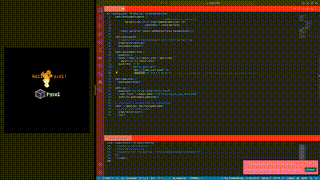

# Getting started with `Pyxel` on Basilisp

## Overview

This project template is designed to help you quickly get started using the [pyxel](https://github.com/kitao/pyxel/tree/main) library with [Basilisp](https://basilisp.readthedocs.io/en/latest/index.html).

The project uses the [Poetry](https://python-poetry.org/) tool to simplify Python dependency management and handle virtual environments. For installation details, see the [Poetry introduction guide](https://python-poetry.org/docs/).

## Project Anatomy

```
.
├── basilisp.edn
├── poetry.lock
├── pyproject.toml
└── src
    └── basilisp_pyxel
        ├── demo.lpy
        └── nrepl.lpy
```

🄑 An empty file indicating to Clojure-enabled editors that this is a Basilisp Project.

🄝 The project's namespace.

① A lock file generated by Poetry that records the exact versions of dependencies installed.

② The configuration file where project metadata, dependencies, and Poetry settings are defined.

③ The `pyxel` demo source code.

④ An auxiliary namespace that facilitates access to the async nREPL server.

⑤ A unit test for the demo code.

## Project Setup

Before running the project for the first time, install the dependencies in a new virtual environment by running
```shell
poetry install
```

Next, activate the project's virtual environment for development with
```bash
poetry shell
```

## Usage

Check the example code in [src/basilisp_pyxel/demo.lpy](src/basilisp_pyxel/demo.lpy), which creates a `Pyxel` window with [01_hello_pyxel](https://github.com/kitao/pyxel/blob/main/python/pyxel/examples/01_hello_pyxel.py) example and a particle fire.



To interact with Python code from Basilisp, you might want to familiarize yourself with [Basilisp's Python Interop features](https://basilisp.readthedocs.io/en/latest/pyinterop.html).

## Running and Developing the Code

The following steps assume you are using the [`basilisp` CLI tool](https://basilisp.readthedocs.io/en/latest/cli.html) within the activated virtual environment.

To load the namespace and run the demo, use the `run -n` option

```shell
basilisp run -n basilisp-pyxel.demo
nREPL server started on port 53666 on host 127.0.0.1 - nrepl://127.0.0.1:53666
```

This command will also start an asynchronous nREPL server bound to the local interface on a random port number. Additionally, it creates a `.nrepl-port` file in the current working, directory your favorite Clojure-enabled editor to discover the server.

The async nREPL server is integrated within `pyxel`'s main loop, you need to put `(nrep/server-work-do!)` in `update` function
```
(defn game-update []
  ;; cooperative multitasking between nREPL server and main loop.
  (nrepl/server-work-do!)
  (development-update))
```
enabling cooperative multitasking between the server and `pyxel` on the same thread.

> [!NOTE]
> Using the core `basilisp nrepl-server` is discouraged, as it can cause crashes. This is because running the main loop and the nREPL server on separate threads is not supported by `pyxel` or most Python libraries, which require single threaded executions.

Happy coding with Basilisp!